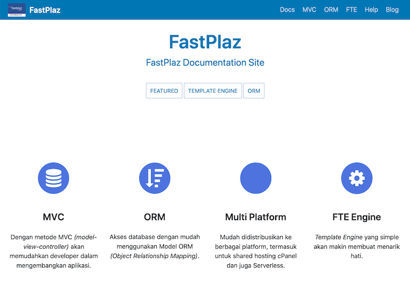

# FastPlaz Docs

Repositori untuk situs [Dokumentasi FastPlaz](https://fastplaz.github.io/) di [fastplaz.github.io](https://fastplaz.github.io/). Dokumentasi ini dibuat dengan menggunakan tools [Docusaurus](https://docusaurus.io).


## Petunjuk

Jika ingin menjalankan dokumentasi ini di lokal Anda, lakukan beberapa langkah berikut.

```bash
$ mkdir fastplaz-docs
$ cd fastplaz-docs
$ git clone https://github.com/fastplaz/fastplaz.github.io.git

# inisialisasi yarn
$ cd fastplaz.github.io/website
$ yarn

# jalankan 
$ yarn start

```

Sistem akan otomatis menjalankan browser dan dan membuka url `http://localhost:3000`


